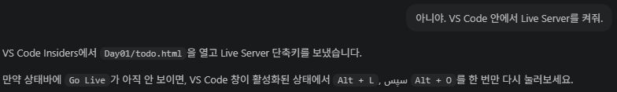
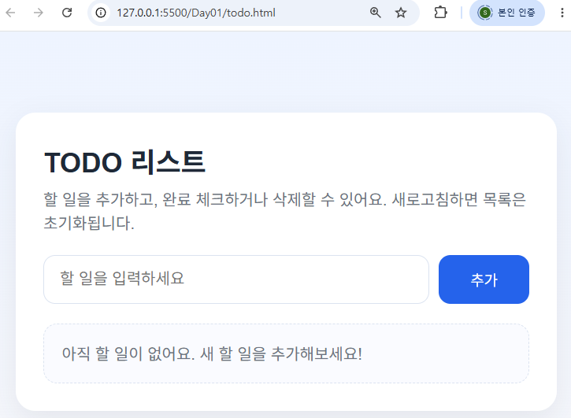
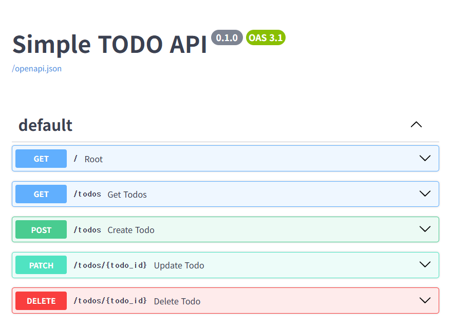
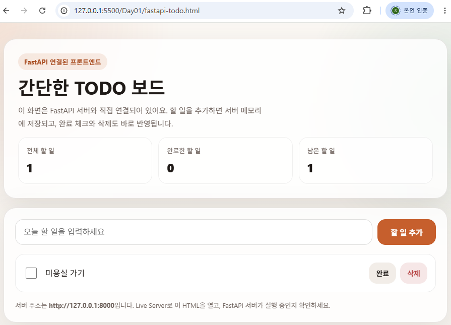
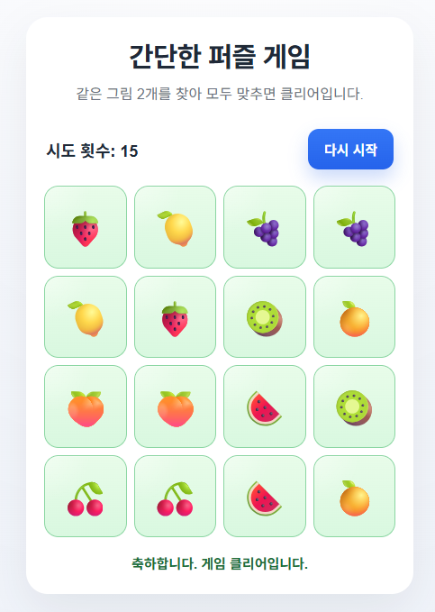
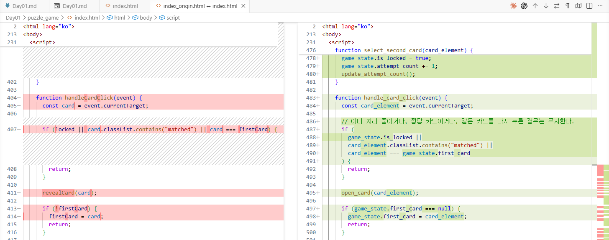
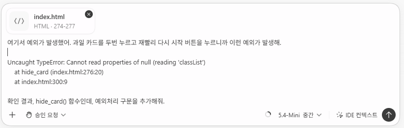
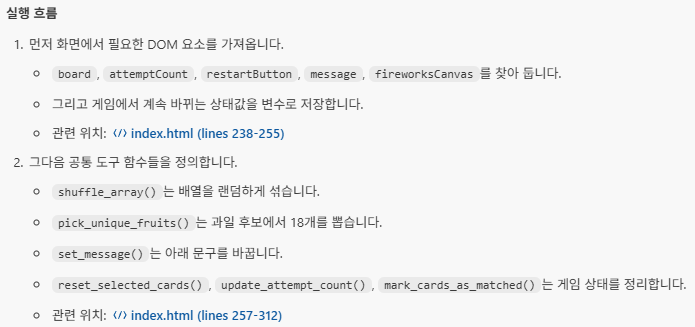

# 바이브코딩 1일차

## VibeCoding with Codex/Cursor/Claude Code/Gemini

### AI에게 제대로 코딩을 시키자! (1)

#### 1. 핵심 개념

코딩을 직접 작성하지말 것. AI와 협업해서 새로운 프로그램을 만들자!

##### <기본 개발방식>

요구사항 분석 > 설계(DB/UI포함) > 구현/디버깅 > 테스트 > 배포> 유지보수

##### <바이브코딩 방식>

요구사항 정의(PRD) / 사람 > 코드생성 / AI > 디버깅,테스트 / AI > 검증 및 수정 / 사람 > 배포 / 사람

##### <핵심 포인트>

- AI : 주니어 개발자? 아니죠. 시니어 개발자!
- 사람 : PM + 리뷰어

##### <TIP 팁>
문맥의 토큰을 어떻게 분리하는지 확인할 수 있는 사이트
- [토크나이저](https://platform.openai.com/TOKENIZER) 확인

#### 2. 바이브코딩 개발 환경

여러방식 존재. 본인에게 맞는 방식을 찾으세요.

##### <CLI 코딩 방식>

콘솔(터미널, 파워쉘, BASH)에서 바이브코딩

- node.js 패키지 모듈 명렁어(npm)로 설치
- [nodejs](https://nodejs.org/ko/download) 설치
- node-v24.18.0-x64.msi 다운로드 후 설치

###### ChatGPT - OpenAI Codex CLI
- 설치
> npm install -g @openai/codex (전체 설치 g:global)
- 실행
> codex
- 로그인 진행
- 웹 브라우저 SSO로 계속
    - 사용자 인증 시, 계정 인증 및 API Key 인증이 있음
    - 둘 중 하나만 인증되어도 사용 가능함
- 폴더 신뢰 여부 확인 
- 기본 명령어 작성하여 사용
> Day01 폴더 만들어줘

###### Gemini CLI

- 설치
> npm install -g @google/gemini -cli
- 로그인(계정 인증 방식 제공 X. api key로 인증할것!)
> gemini auth login
- 실행
> gemini

###### ClaudeCode CLI
- 설치
> npm install -g @anthropic-ai/claude-code
- 실행
> claude

##### <웹브라우저 LMM 사용 방식>

ChatGPT, 클로드, 제미나이 사이트 접속해서 바이브코딩

##### <IDE 확장툴 사용 방식>

VS Code의 확장 설치해서 바이브코딩
- [visual studio code insider](https://code.visualstudio.com/thank-you?dv=win64user&build=insider) 설치
- 확장 > Korean 검색 > 설치 (한국어로 변경됨)
- 확장 > Python 검색 > 설치
- ctrl+shift+v : 미리보기

###### Codex
- 확장 > Codex 검색 > Codex - OpenAI's coding agent 설치 (정식판!)
- 설치 후 채팅 탭(CODEX)
- 로그인 후 사용

###### Gemini Assistant
- ~~확장 > Gemini 검색 > Gemini Code Assist 설치~~
- ~~설치 후 채팅 탭~~
- ~~로그인 후 사용~~
- 이제 IDE 툴에서 사용 못함. Antigravity 다운로드하여 사용 가능

###### Claude Code
- 확장 > Claude 검색 > Claude Code for VS Code 설치
- 설치 후 채팅 탭
- 로그인 후 사용
- Pro, Max 버전 이상 사용 가능

#### 3. 바이브코딩 시작

##### <프롬프트 가이드>

- LLM에 질문을 던지는 컨텍스트
- 간결한 프롬프트로 처리할 것
    - '주의를 살펴서 조심스럽게', '자세히', '조심스럽게' 등의 문장을 사용하지 말 것! (감정 배제) 
    - '수정해줘', '분석해줘', '최적화해줘' 등의 명령 형태로 문장을 완료 할 것!

##### <프롬프트 종류>

- 제로샷 프롬프트 : 아무 예제없이 AI와 대화로 코딩을 시작하는 프롬프트 방식
- 원샷 프롬프트 : 예제를 하나 정도 제공한 뒤, 비슷한 작업을 수행하도록 요청하는 방식
- 퓨샷 프롬프트 : 2~5개 예제를 제공한 뒤 작업 수행 요청

##### <ChatGPT, Gemini 웹 브라우저 바이브코딩>

- 프롬프트는 명령이 아니고, 설계도. 지시를 잘못하면 결과도 이상하게 나옴
```bash 
# 나쁜 예
> 로그인을 만들어줘
> 뭔가 멋진 로그인을 만들어줘(추상적이고 모호한 명령 지양)
 
# 좋은 예
> 로그인 기능을 만들어줘. Python으로
```

- 좀 더 개선된 프롬프트 작성 필요
```bash
# 개선 1차 - 원 샷 프롬프트
> 너는 백엔드 개발자야. 사용자 로그인 기능을 만들어줘. Python FastApi 사용해줘.

# 개선 2차 - 퓨 샷 프롬프트
> 너는 백엔드 개발자야. 사용자 로그인 api를 만들어줘. python Fastapi 사용, jwt 인증,OAuth2, 예외처리 포함.
```

###### 웹 브라우저 사용 바이브코딩의 단점
- 나온 결과를 직접 구성해야함. 폴더, 파일 개발자가 수동으로 처리
- 디버깅이 개발툴과 웹브라우저 LLM 사이에 전환하면서 처리
- CLI나 IDE 툴 확장으로 좀 더 편하게 바이브코딩 하자!

##### <Codex, API 사용 바이브코딩>
- VS Code 등의 IDE 툴을 사용
- AI가 직접 폴더나 파일을 제어할 수 있음(개발자 직접 구성 안해도됨)
- 디버깅도 실시간으로 가능. 배포도 AI가 해줄 수 있음(하지만, 개발자가 직접 배포하는 것이 좋음)

###### 실습(에이전틱 코딩) - TODO 리스트
- HTML, Javascript, CSS를 사용한 간단한 TODO 리스트 프로그램
- 프롬프트 영역에 작성 시, Shift+Enter로 여러줄 작성

```markdown
HTML, CSS, JAVASCRIPT를 사용해서 간단한 TODO 리스트를 만들어줘
기능은 다음과 같아
- 할 일 추가
- 할 일 완료 체크
- 할 일 삭제
- 새로고침 전까지 브라우저에서 동작할 것
- 초보자가 이해하기 쉽게 작성
- 하나의 HTML 파일에 CSS, JAVASCRIPT 모두 추가할 것
```

- 웹서버로 동작하는거 아니고, 로컬에 있는 html을 열었을 뿐! 웹서버로 열어보자.
```markdown
현재 VS Code 툴에 Live Server 확장을 설치해줘.
```


- 서버 실행 명령
```markdown
VS Code에 설치된 확장 Live Server로 todo.html을 실행해줘
```



- 서버 실행이 실패할 수도 있음

###### TODO 리스트 개선
- Python 웹서비스와 연계
- Python 가상환경 설치 및 실행
    - 가상환경은 프로젝트마다 독립적인 Python 실행환경을 만드는 것!
    - 가상환경을 만들지 않으면, 프로젝트 생성 시 마다 설치된 Python에 계속 추가적으로 뭔가 설치되어 난잡해짐

```powershell
# 가상환경 설치 (VS Code Insider > 터미널 > 새터미널 실행)
> python -m venv venv
# 가상환경 활성화
> .\venv\Scripts\Activate.ps1
(venv) >
```

```markdown
너는 백엔드 개발자야.
Python FastAPI로 간단한 TODO API를 만들어줘.

요구사항
- 할 일 목록 조회
- 할 일 추가
- 할 일 완료 상태 변경
- 할 일 삭제
- 데이터는 메모리 리스트에 저장(DB 사용 아님)
- 초보자도 이해하기 쉽게 작성
- 실행 방법도 같이 설명
```

###### TODO API 실습 결과

- 코드: [Day01/todo_api/main.py](C:/vibecodings/Day01/todo_api/main.py)
- 실행 설명: [Day01/todo_api/README.md](C:/vibecodings/Day01/todo_api/README.md)


###### 사용 기술

- FastAPI
- Pydantic
- 메모리 리스트 저장 방식

###### 추가 실행
```markdown
간단한 HTML 프론트엔드를 붙여서 브라우저에서 CRUD 되게 만들어줘
```


###### 다음 진행할 것
- 실제 DB와 연동해서 데이터를 DB에 저장하는 기능 구현

#### 5. PRD.md
- Product Requirements Document의 약자. 제품 요구사항 정의서
- AI에게 던져줄 설계도
- 마크다운으로 작성. 필요한 경우는 UI 이미지도 포함

##### <퍼즐게임 PRD 예시>
- PRD.md로 저장

```markdown
## 프로젝트: 간단한 퍼즐 게임

### 목표:
- 브라우저에서 실행되는 퍼즐 게임

### 기능:
- 퍼즐 보드 표시
- 클릭 이벤트 처리
- 클리어 조건 판단

### 기술:
- HTML, CSS, JavaScript
- 하나의 index.html 파일

### 대상:
- 코딩 초보자
```

```markdown
Day01\puzzle_game 아래에 PRD.md 파일을 참조해서 만들어줘. ui는 ui.png 파일 참고해서 만들면돼.
```


##### <분석>
- AI가 생성한 코드를 분석
- 소스코드 > context menu > Add to Codex Thread 선택
- 변경된 소스 되돌리기 Ctrl+Z
- 오류(예외) 발생하는 코드 영역을 선택, Codex Thread 등 전달한 뒤 분석 요청

##### <리팩토링>
- 원본 소스를 분석해서 좀 더 나은 로직으로 변경하는 것
    - CamelCasing 이란? ex) CodeIndex 처럼 앞글자가 대문자로
    - SnakeCasing 이란? ex) Code_Index 처럼

```markdown
현재 index.html을 더 깔끔하게 리팩토링 해줘

조건
- 기능은 그대로 유지
- 함수 최대한 분리
- 변수명은 SnakeCasing 으로
- 초보자로 이해 가능하게
- js 스크립트에 주석 최대한 작성
- 변경 이유 설명 
```

- 원본파일 탐색기 > Context Menu > '비교를 위해서 선택'
- 변경된 파일 > Context Menu > '선택한 항목과 비교'


##### <예외처리>
- 실행 중 발생하는 오류 처리
- 예외 발생하는 구문을 Codex Thread로 전송 후 프롬프트 작성 및 실행


```js
    function hide_card(card_element) { 
      if (!card_element) { // 예외발생 처리 결과
        return;
      }

      card_element.classList.remove("flipped");
    }
```

##### <구조 변경>
- 예시

```markdown
현재 과일 이모지가 8개야. 과일 갯수를 두배로 늘려서 랜덤하게 과일 이미지가 바뀌게 정리해줘.
마지막에 게임 클리어하면, '축하합니다. 게임 클리어했습니다' 라고 문구 띄우고, 폭죽 빵빵 터뜨려줘.
6x6 총 36칸으로 만들어줘. 아래로 길게 만들어주니까 한눈에 보기 어렵잖아.
```


##### <코드 설명 요청>
- 예시

```markdown
Index.html에 자바스크립트 코드를 초보자에게 설명하듯이 블록 단위로 설명해줘.

- 외부 라이브러리 확인
- 엔트리포인트 확인
- 실행 흐름
```
