# 바이브코딩 2일차
## VibeCoing with LLM

### AI에게 제대로 코딩을 시키자! (2)


#### 1. 퍼즐게임 기능 개선

- 점수 계산
```markdown
현재 폴더 Day01에 index.html이 있어. 이걸 기능 개선할 거야. 
시도 횟수 옆에 같은 그림을 맞출 때마다 점수 계산이 돼서 10점씩 올라가도록 해줘. 계산된 점수는 시도횟수 오른쪽에 나오도록 해줘. 나온 파일은 Day02 폴더에 넣어줘.
파일명은 index.html로 만들어줘
```
- 난이도 조정
```markdown
Day02의 puzzle_game 폴더에 있는 파일을 수정할거야.
게임 난이도 조정할래. 레벨 시스템을 도입해줘.
쉬운 난이도는 3x3, 중간 난이도는 4x4, 5x5, 제일어려운 난이도는 6x6 갯수의 퍼즐을 맞추도록 변경해줘. 
난이도는 콤보박스에서 쉬움, 중간1, 중간2, 어려움 이렇게 선택하도록 만들어줘.

짝수 안맞아서 발생하는 빈칸은 가운데에 배치해주고, 빈칸에 선글라스 낀 이모지 넣어줘.
```

- 타임아웃 설정 
```markdown
그런데 이렇게 하면 게임에 스릴이 없어. 
타임아웃 시간을 줘서 시간 내에 다 못맞추면 게임오버가 되도록 개선해줘. 시간은 1분으로 해줘
```
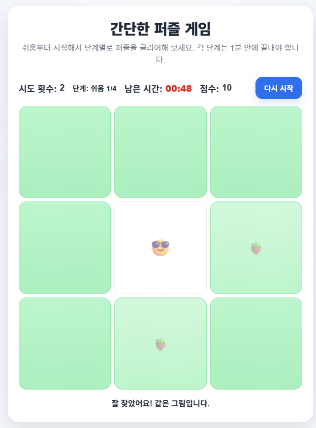
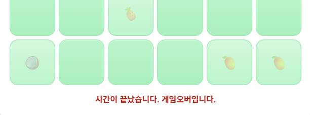

#### 2. PRD.md 개선
- PRD.md 파일 첨부하고 프롬프트 입력
```markdown
지금까지 만든 퍼즐게임을 바탕으로 PRD.md를 다시 작성해줘.
```
- 필요한 경우 PRD.md를 수정

#### 3. 디버깅

- 프롬프트 디버깅 요청
- 에러가 나면, 추측하지 말고, 에러전체를 AI에게 던져서 원인과 해결책을 찾으라 - 안드레아 카파시

#### 4. 실습

- 유튜브 학습 기록 앱
- [PRD.md](./Day02/youtube_log/PRD.md) 작성
- 바이브코딩 결과 화면
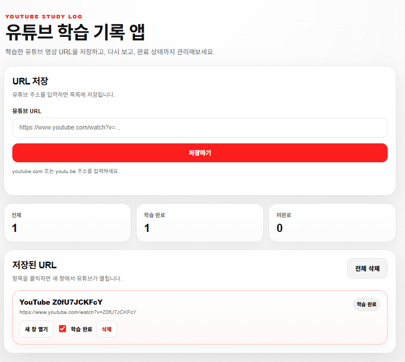
- 기능개선

```markdown
현재 유튜브 링크를 넣으면 잘 저장은 되는데, 유튜브 제목이 뭔지 알 수가 없네. 
유튜브 제목을 가져와서 표출해줄 수 있는 방법이 있을까?
```
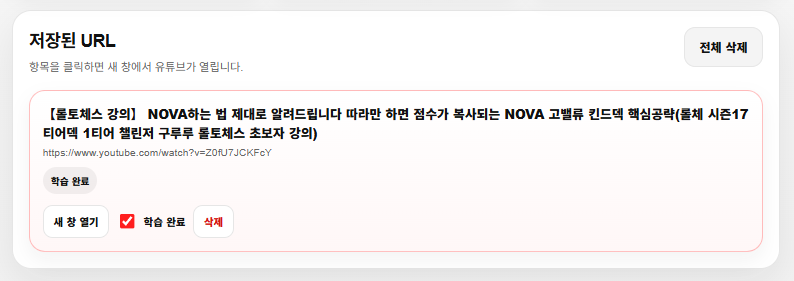

```markdown
너가 말한대로 썸네일 추가해줘. 
근데 사이즈 너무 크게 하지는 말고 현재 UI를 해치지 않는 선에서 진행해줘.
```
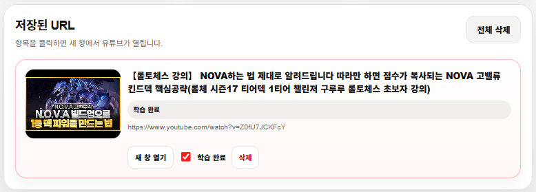

```markdown
유튜브 링크가 아닌건 붙여넣기 안되게 수정해줘
```
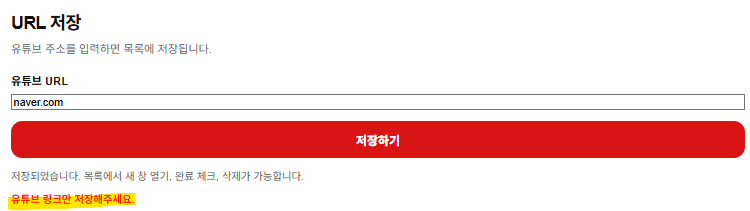

```markdown
이전에 등록한 url은 중복 등록 안되게 막아줘
```
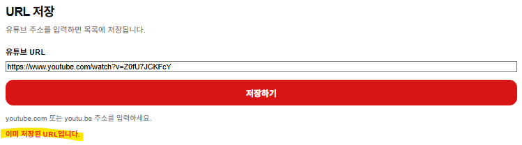

#### 4. 배포

- 모바일 앱(플레이스토어, 앱스토어) 논외
- 웹사이트 URL로 사용자에게 오픈할 수 있는 방법
-웹서버 생성, URL 도메인 구매, 설정...

##### 4-1. Git 설치
- [Git](https://git-scm.com/) 설치

##### 4-2. Github 가입
- [GitHub](https://github.com/) 가입
    - 이메일 계정으로 가입되어 있음
- 리포지토리 생성
    - Repository Name 필수
    - Visibility - Public
    - Readme 추가 권장
    - .gitIgnore 개발하는 언어에 따라 선택(필수!) > 안하면 다운받는 사람들의 환경이 이상해 질 수 있음

##### 4-3. GitHub 리포지토리 클론(소스 업로드)
- 내 컴퓨터에 복사
    - Code 버튼 클릭
    - Clone > HTTPS 주소 복사

    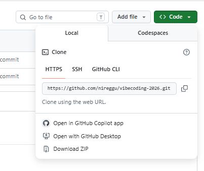
- 윈도우 탐색기에서 경로 선택 및 폴더 생성
    - Context Menu > 터미널에서 열기
    ```bash
    > git clone https://github.com/nireggu/vibecoding-2026.git
    ```
    - 폴더에 git 폴더(vibecoding-2026) 생성
    - git 폴더에 이전에 만들었던 소스 이동하기
- visual studio code - insider 재기동
    - git 폴더로 재탐색
    - 소스제어 아이콘에 파일 숫자가 올라감(연동 되고있음)

    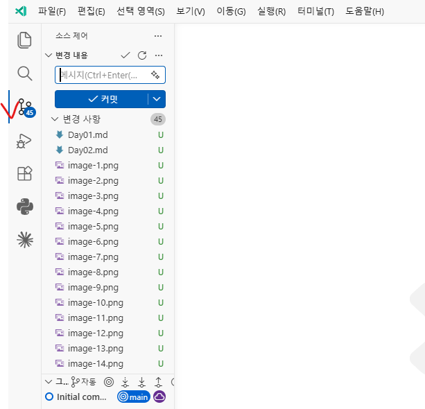
- GitHub Push 완료

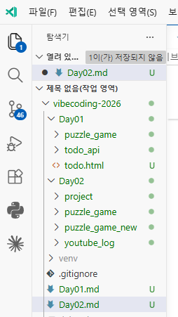

##### 4-4. GitHub 푸시(업로드)
- 로컬 저장소 파일을 리모트 저장소(GitHub)로 업로드 하는 작업
    - 소스제어 클릭
    - 변경내용 아래메시지를 반드시 작성!
    - 커밋 X -> 드롭다운 버튼 클릭, 커밋 및 동기화 클릭
    * 커밋 및 푸시 : 공동 작업할 때, 다른 사람 소스와 충돌날 수도 있음

- 다른 사람의 주소를 Clone 한 경우, 아래와 같은 메시지 발생

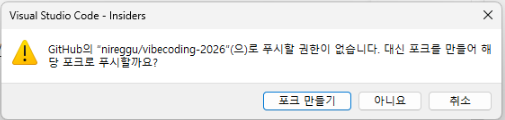

해결방법 : 제어판 > 사용자 계정 > 자격 증명 관리자 > Windows 자격 증명 > 일반 자격 증명에서 
github.com 으로 되어있는 증명 모두 삭제하기


##### 4-5. Vercel 가입
- [Vercel](https://www.vercel.com) 회원가입
- 메인화면 오른쪽 상단 add -> new project 선택

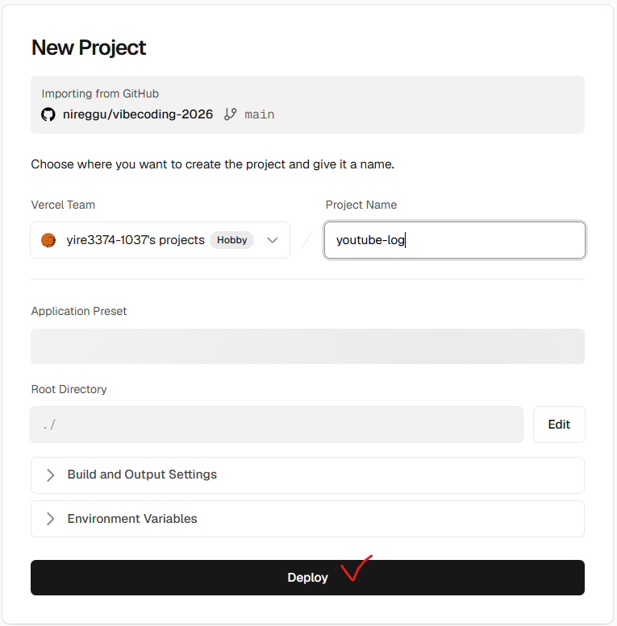

- 배포 결과


#### 5. 추가 내용

##### 5-1. AI에게 프로젝트 먼저 분석시키기


#### 6. 코딩 테스트

- 바이브 코딩으로 직접 프로그램 만들어보기